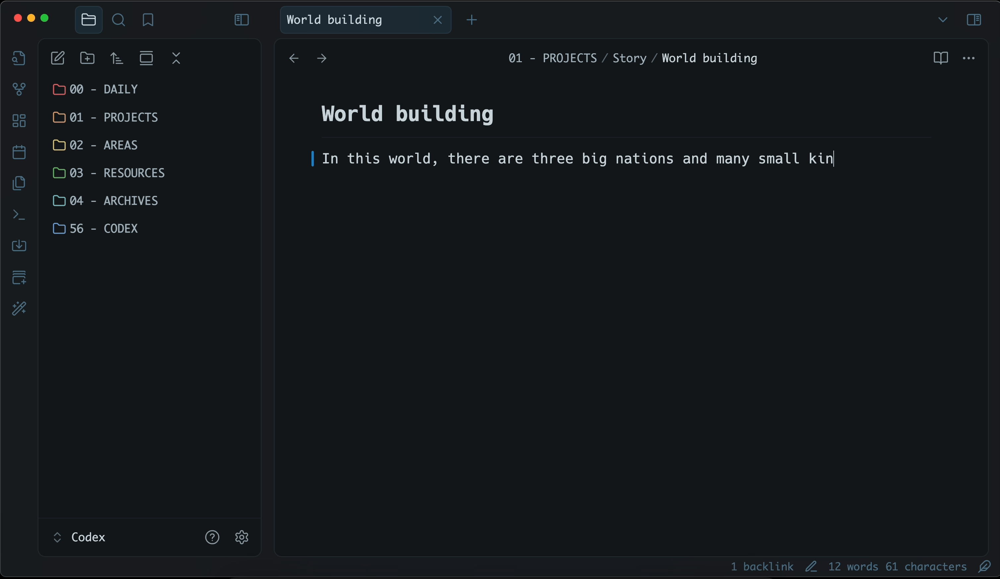

# Inscribe

Inscribe is an AI-powered inline autocompletion plugin for Obsidian. It will generate autocompletions as you type and you can accept or reject them with TAB.

## Get started
### 1. Setup a provider
Inscribe supports following providers:
- Ollama (local)
- Gemini
- OpenAI
- OpenAI compatible

More providers will be added if requested. Or better, feel free to create PR.

### 2. Customize prompts
You can set both system and user prompts to guide the AI's responses. For user prompt, template variables (mustache) can be used to provide context;
- **{{pre_cursor}}**: text before cursor
- **{{post_cursor}}**: text after cursor
- **{{active_sentence}}**: the current sentence
- **{{last_line}}**: last line of the active note

### 3. Per-Path profile assignments (Optional)
You can create multiple profiles and assign them to specific note paths.
For example, you might want a more formal profile for research notes and a more creative one for writing fiction. Corresponding profile will be automatically activated when you open a note matching the assigned path.

## Tips
### What provider should you use?
Given the high frequency of API calls, using Ollama is highly recommended to reduce costs and improve response times. And for Ollama models, consider using a model bigger than 8B params. For now, `gemma3:12b` is a good starting point.

Also, Google Gemini is a great option. It is fast and free tier is generous.

## Disable completions using path config
Using per-path profile config, you can enable completions only for specific paths. This way, you can avoid annoying interruptions in notes where autocompletion isn't desired.

## Support
If you find this plugin useful:

